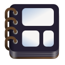

<div align="center">


# Memories
Organize your memories


</div>

## Support

The only version of Memories that's supported is the one shipped on
Flathub.

**Do not file bugs that don't happen with the Flathub version.**

If the problem still occurs with the Flathub version, please test the
nightly flatpak by downloading the GitLab CI/CD build job artifact.

## Building from Source

We use Git for version control, and Meson/Ninja as the build
system for Memories.
The quickest way to build for release is to do the following:

### Getting the Source

```sh
git clone https://gitlab.gnome.org/maxrdz/Memories
cd Memories
```

### Build Memories

Before building Memories, make sure you have the required
dependencies installed. Meson will let you know what binaries or
libraries it is missing or cannot find, but you can also read the
root [Meson](./meson.build) build file to see the list of
dependencies it searches for on your system.

```sh
meson setup build
meson compile -C build
meson install -C build
```

You can append the `-Dprofile=devel` argument to build for debug:

```sh
meson setup builddevel -Dprofile=devel
meson compile -C builddevel
meson install -C builddevel
```

Memories can be built with haptic feedback support (via feedbackd)
using the `-Duse-feedbackd=true` Meson build parameter.
This is currently an experimental feature of Memories.

### Running from the source tree

If you would like to run Memories without installing it on your
system, you can use `cargo` directly to build and run the source.

### Uninstalling

To uninstall the app build from your local system:
```sh
sudo ninja -C build uninstall
```
Replace `build` with the Meson build directory of the
application build version that you want to uninstall.

## Cross Compiling

For cross compiling, we use
[cross-rs](https://github.com/cross-rs/cross), which is a
drop-in replacement for Cargo. This tool allows the developer
to cross compile using **Docker** (or a Docker drop-in
replacement, such as [Podman](https://podman.io/))
instead of installing dependencies and additional pkg-conf
configuration on the build machine. On setup, Meson will check
that cross and docker, or an alternative, are installed.

To install the cross binary on your system user's cargo:
```sh
cargo install cross --git https://github.com/cross-rs/cross
```
NOTE: This will install the `cross` program under `~/.cargo/bin`.
Be sure to add `~/.cargo/bin` to your PATH so Meson can find it.

To setup a build that targets ARM64 GNU/Linux:

```sh
meson setup buildaarch64 -Dtarget=aarch64-unknown-linux-gnu
```

Note that we do not use cross-rs for building the aarch64 flatpak
artifact in Memories' CI/CD pipeline. The `flatpak@aarch64` job
runs on an ARM machine, so it compiles Memories natively to aarch64.

## Contributing

Please read the project's [Contributing Guide](./CONTRIBUTING.md).

It is very helpful for new contributors to read the
[GNOME Handbook](https://handbook.gnome.org/development/change-submission.html)
before starting to write your own changes to Memories.

## Code of Conduct

The Memories project, its maintainers, and its contributors are
required to follow the
[GNOME Code of Conduct](https://conduct.gnome.org/).

## Copyright and License

Copyright &copy; 2024 Max Rodriguez \<me@maxrdz.com\>

"Memories" can be found at https://gitlab.gnome.org/maxrdz/Memories

"Memories" is distributed under the terms of the GNU General Public
License, either version 3.0 or, at your option, any later
version WITHOUT ANY WARRANTY. You can read the full copy of
the software license in the [COPYING](./COPYING) file.
